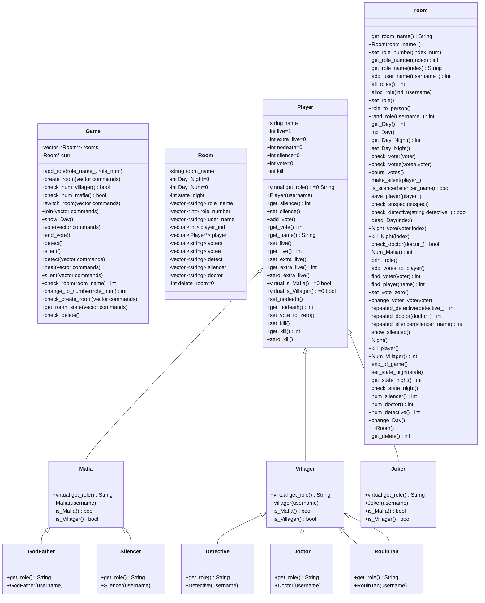

# Mafia Game Implementation in C++

### Overview:  
This project is a C++ object-oriented system designed to assist the "god" in moderating the Mafia game. The system provides a comprehensive solution for managing multiple games across different rooms simultaneously, allowing the god to assign roles, track game events, and perform necessary calculations to determine game outcomes.

The Mafia game involves various roles, including Joker, Villager, Detective, Doctor, RouinTan, Mafia, GodFather, and Silencer, which are randomly assigned to players. The system is designed with a flexible class structure: a Game class that manages Room instances, where each room hosts players with different roles.

A base class User underpins the system, with derived classes representing the different player roles, such as Villager, Mafia, and Joker. Further specializations include roles like Detective, Doctor, and RouinTan derived from the Villager class, and GodFather and Silencer derived from the Mafia class. This design ensures that the god can effectively manage the game, providing a seamless and organized experience for all participant

### Roles:   
* Joker: Has unique objectives and can influence the game unpredictably.
* Villager: A regular townsperson with no special abilities.
* Detective: Can investigate players to determine their roles.
* Doctor: Can heal one player per round, saving them from potential elimination.
* RouinTan: Has special abilities.
* Mafia: Works with the other Mafia members to eliminate the Villagers.
* GodFather: The leader of the Mafia, often undetectable by the Detective.
* Silencer: Can silence one player per round, preventing them from speaking or voting.

### System Design: 

### Commands: 
The following commands are available for players to interact with the game:

* Create_room room_name (role_name number): Creates a new game room with the specified roles and number of players.
* Switch_room room_number: Switches the player to the specified game room.
* Join user_name: Joins the game with the specified user name.
* Vote voter_name votee_name: Casts a vote from the voter to the votee.
* End_vote: Ends the voting phase.
* Detect detective_name suspect_name: Allows the Detective to investigate a suspect.
* Heal doctor_name person_name: Allows the Doctor to heal a person.
* Silent silencer_name person: Allows the Silencer to silence a player.
* Day day_num: Advances the game to the specified day number.
* Killed user_name: Marks the specified user as killed.
* Silenced user_name: Marks the specified user as silenced.
* Get_room_state: Outputs the current state of the room, including the number of Mafia members and Villagers.

### License:

### Usage:
Follow the prompts in the game to create rooms, join rooms, assign roles, and play the game using the available commands.

